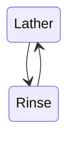

Minimum Viable Documentation
============================

This project provides a simple, repeatable way to dispel tribal knowledge
through a document template and guidelines on how to use it.

### Resources

- [Github Repo](https://github.com/davidrjonas/minimum-viable-documentation)
- [Mermaid Live Editor](https://mermaid-js.github.io/mermaid-live-editor/)
- [Github Flavored Markdown](https://github.github.com/gfm/)

Goals and Scope
===============

- Make it easy for the author to focus on what is unique about their component
  and not the structure of the documentation.
- Resulting documents must be able to get a technical person oriented in under
  15 minutes.
- Resulting documents help maintain the scope and achieve the goals of the project.
- Template and Guidelines are reusable at varying levels of a documentation
  hierarchy, from an entire web project to a single PHP namespace.
- Remove the cognitive burden of reinventing what's important every project.

This project is limited to what is needed for breaking down tribal knowledge,
specifically in software components. This project does not try to enumerate
all documentation a project should have.

Background
==========

Problem: Knowledge about systems are stored in peoples heads and is easily lost
or forgotten. No one person has a complete picture. No way to share the
knowledge with others, new people apart from oral tradition. Pretty much
"tribal knowledge".

The obvious solution is written documentation but it has its own problems.

Problem with written documentation: it's tedious and useless.

- It's a pain to get right in the first place.
- It is difficult to know now what we'd like to know in the future.
- It's quickly outdated which can be confusing and misleading.
- It is hard to be efficient and no one likes to waste their time.
- **No one reads it.**

Concepts
========

- `The Guidelines` The document that expands on the in-line help.
- `The Template` The structure for writing a new document with some in-line help.
- `Tribal Knowledge` Any unwritten information that is not commonly known by others within a company.

Critical Points
===============

- Get a technical person oriented in under 15 minutes.
- Describe what is unique to this component, anything that may be unexpected.
- Audience: you five years from now, someone brand new to this component.
- Pictures really help!

Guiding Principles
==================

- Keeping it short is key.
- Focus on what is unique, that's the way to keep it short.
- Keeping it in the forefront, the readme, is the best way to keep it accurate.
- Accessible, usable information is the priority. This project is guidelines not rules.

The template is a little different than external project READMEs. In general
the reader will already know _something_ about the project and just needs to
learn or be reminded of the specifics of this one.

Why in the readme? Why not its own document? Documentation already has the
problem of being ignored. Putting it up front as simply as possible may help in
keeping it accurate.

Putting the template and guidelines in GitHub will allow it to evolve through
collaboration. Someone will always be the official owner of the repo, required
to review and merge changes.

[MermaidJS][] is really good and it is easily supported. Pictures break up a document and can sum up a lot of information quickly.

[MermaidJS]: https://mermaid-js.github.io/mermaid/#/

Examples
========

- This README is an application of Template.md!

Usage
=====

Copy [Template.md](./Template.md) into your component as README.md and start editing.
